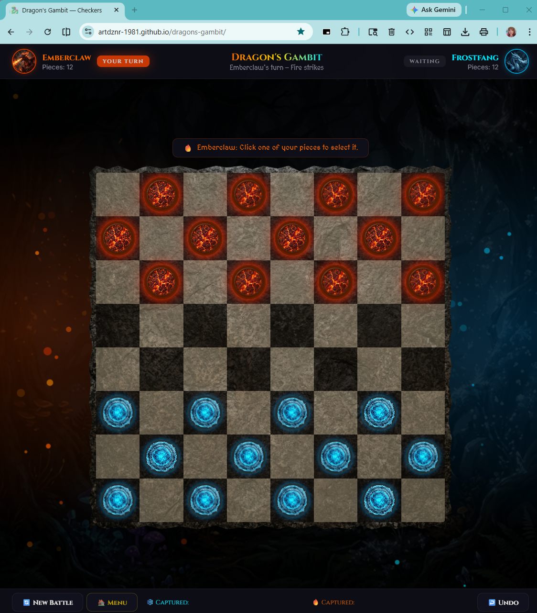

# 🐉 Dragon's Gambit — A Battle of Fire & Ice

> A dragon-themed two-player checkers game built with pure HTML, CSS, and JavaScript. No frameworks. No dependencies. Just epic battles.

---

## 🎮 What Is It?

**Dragon's Gambit** is a fully playable checkers game played in the browser. Two players choose their dragon names — one commands the **🔥 Fire Dragons**, the other the **❄️ Ice Dragons** — and battle head-to-head on an 8×8 board.

## ✨ Features

- 🐉 **Dragon-themed UI** — custom dragon avatars, fire & ice color schemes, animated particle effects
- ⚔️ **Choose who goes first** — pick 🔥 Fire, ❄️ Ice, or 🔥❄️ Random before each battle
- 👑 **Full checkers rules** — forced jumps, multi-jumps, and kinging
- 💡 **Hint bar** — guides new players through their turn
- ↩️ **Undo move** — take back your last move
- 🔄 **New Battle** — reset and play again instantly from the board
- 🏠 **Main Menu** — return to the splash screen any time mid-game
- 🏆 **Victory screen** — animated dragon fly-in with a dramatic victory message
- 🔒 **Security headers** — Content Security Policy baked in
- 📱 **Responsive** — playable on desktop and mobile

## 🕹️ How to Play

| Action | How |
|---|---|
| **Choose who goes first** | Select 🔥 Fire, ❄️ Ice, or 🔥❄️ Random on the splash screen |
| **Select a piece** | Click one of your colored pieces |
| **Move** | Click a highlighted square to move diagonally forward |
| **Capture** | Jump over an opponent's piece to remove it — *you must jump if you can* |
| **Multi-jump** | If another jump is available after capturing, keep jumping |
| **King** | Reach the opposite end of the board to become a King 👑 — kings move in all directions |
| **Win** | Capture all enemy pieces, or block them so they can't move |

## 🚀 Running Locally

No install required — just open the file in your browser:

```
checkers-game/
├── index.html        ← open this in your browser
├── game.js
├── style.css
└── images/
    ├── fire_dragon.png   ← Fire player avatar
    ├── ice_dragon.png    ← Ice player avatar
    ├── fire_piece.png    ← Fire checker piece texture
    ├── ice_piece.png     ← Ice checker piece texture
    ├── stone_board.png   ← Board texture
    ├── forest_bg.png     ← Background scene
    └── screenshot.png    ← Gameplay preview (shown in README)
```

Simply double-click `index.html` or drag it into any modern browser (Chrome, Edge, Firefox).

## 🛠️ Tech Stack

| Layer | Technology |
|---|---|
| Structure | HTML5 |
| Styling | CSS3 (custom animations, glassmorphism, Google Fonts — Cinzel) |
| Logic | Vanilla JavaScript (ES6+) |
| No build step | ✅ Zero dependencies |

## 📸 Screenshots



> Emberclaw (🔥 Fire) vs Frostfang (❄️ Ice) — may the best dragon win!

## 📜 License

MIT — free to use, share, and modify.

